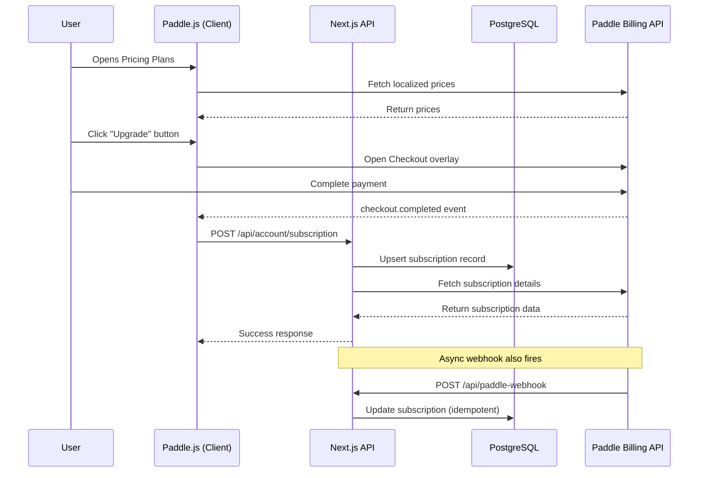

# Paddle & User Membership Management - Comprehensive Analysis Report

**Date**: 2025-11-10  
**Application**: AI Podcast Curator (PodSlice)  
**Purpose**: Knowledge base for stakeholders and AI assistants

---

## 1. Executive Summary

### Overview

The AI Podcast Curator (PodSlice) is a Next.js-based SaaS application that provides AI-powered podcast summarization and curation services. The platform integrates **Paddle** as its payment and subscription management system to monetize premium features through a tiered membership model.

### Core Features

1. **AI-Generated Podcast Summaries**: Users can create AI-powered audio and text summaries from YouTube podcast episodes
2. **Curated Bundle Feeds**: Access to pre-curated and custom podcast bundle collections
3. **Personalized Content Curation**: Custom user-curated profiles with automated episode generation
4. **Shared Bundles**: Community-created episode collections
5. **Multi-tier Subscription Model**: Three distinct membership tiers with progressive feature access

### Business Model

The platform operates on a **freemium subscription model** with three tiers:

- **Free Slice**: Limited access to pre-curated bundles, 3 episode limit, 7-day trial
- **Casual Listener** (~$5-10/month): Enhanced access to curated bundles and custom podcast selections
- **Curate Control** (~$15-20/month): Full access including AI-powered episode generation (30 episodes per month)

The subscription system is powered by **Paddle Billing**, which handles payment processing, subscription lifecycle management, and customer portal access for international customers.

---

## 2. Core Structure

### High-Level Architecture

The Paddle & User Membership Management system follows a **three-layer architecture**:

```
┌─────────────────────────────────────────────────────────────┐
│                    Client Layer (React)                      │
│  - Pricing Plans UI                                         │
│  - Subscription Management Dashboard                        │
│  - Paddle.js Checkout Integration                          │
└─────────────────────────────────────────────────────────────┘
                            ↕
┌─────────────────────────────────────────────────────────────┐
│                 Application Layer (Next.js API)              │
│  - Subscription CRUD APIs                                   │
│  - Webhook Event Processing                                 │
│  - Plan Gate Enforcement                                    │
│  - Usage Tracking & Limits                                  │
└─────────────────────────────────────────────────────────────┘
                            ↕
┌─────────────────────────────────────────────────────────────┐
│                    Data Layer (Prisma + PostgreSQL)          │
│  - User Records (with paddle_customer_id)                   │
│  - Subscription Records (linked to Paddle)                  │
│  - UserEpisode Records (usage tracking)                     │
└─────────────────────────────────────────────────────────────┘
                            ↕
┌─────────────────────────────────────────────────────────────┐
│                External Services (Paddle Billing)            │
│  - Payment Processing                                       │
│  - Subscription Lifecycle                                   │
│  - Customer Portal                                          │
│  - Webhook Events                                           │
└─────────────────────────────────────────────────────────────┘
```

### Integration Flow

#### 1. User Authentication
- **Clerk** handles authentication and user identity
- User records are synchronized to local database with `user_id` (from Clerk) as primary key
- `paddle_customer_id` field links local user to Paddle customer

#### 2. Subscription Purchase Flow



#### 3. Plan Gate Enforcement

Feature access is controlled through **hierarchical plan gates**:

- `NONE` → No paid features
- `FREE_SLICE` → Basic curated bundles
- `CASUAL_LISTENER` → Enhanced bundles + custom curation
- `CURATE_CONTROL` → All features + AI episode generation

**Access Resolution Logic**:
- Free Slice users: `[NONE, FREE_SLICE]`
- Casual Listener users: `[NONE, FREE_SLICE, CASUAL_LISTENER]`
- Curate Control users: `[NONE, FREE_SLICE, CASUAL_LISTENER, CURATE_CONTROL]`

This hierarchical system ensures users can access all content from lower tiers.

---

## 3. Business Logic

### Core User Flows

#### Flow 1: New User Onboarding & Trial

1. **User Registration**
   - User signs up via Clerk authentication
   - Local user record created in database
   - Default status: No active subscription (effectively `FREE_SLICE` tier)
   - User has access to limited pre-curated bundles

2. **Trial Activation**
   - User browses pricing plans at `/manage-membership`
   - Paddle.js initializes with localized pricing
   - User selects a plan and completes checkout
   - Paddle creates subscription with 7-day trial period
   - Webhook updates subscription status to `trialing`

3. **Trial to Active Conversion**
   - Paddle automatically handles trial expiration
   - On successful payment: `subscription.updated` webhook fires
   - Status changes from `trialing` to `active`
   - User retains full access to paid tier features

#### Flow 2: AI Episode Generation (Curate Control Feature)

1. **Access Check**
   ```typescript
   // User must have Curate Control plan
   const subscription = await prisma.subscription.findFirst({
     where: { user_id: userId }
   });
   const hasCurateControl = hasCurateControlAccess(subscription?.plan_type);
   ```

2. **Usage Limit Enforcement**
   - System tracks completed `UserEpisode` records
   - Each episode has a `summary_length` field (`SHORT`, `MEDIUM`, `LONG`)
   - **Weighted Credit System**:
     - `SHORT` (1-2 mins): 1 credit
     - `MEDIUM` (3-4 mins): 1 credit
     - `LONG` (5-7 mins): 2 credits
   - Monthly limit for Curate Control: **30 credits**

3. **Episode Creation Process**
   ```
   User submits YouTube URL → 
   API validates usage credits → 
   Creates pending UserEpisode record → 
   Triggers Inngest workflow → 
   Transcription & AI summarization → 
   Audio generation via Google TTS → 
   Upload to GCS → 
   Status updates to COMPLETED
   ```

#### Flow 3: Bundle Access Control

1. **Curated Bundles** (Admin-created)
   - Each bundle has `min_plan` field (PlanGate enum)
   - API route `/api/curated-bundles` filters bundles based on user's plan
   - Returns `canInteract` boolean and `lockReason` for each bundle

2. **Shared Bundles** (User-created)
   - Available to `FREE_SLICE`, `CASUAL_LISTENER`, and `CURATE_CONTROL`
   - Users can create collections of their AI-generated episodes
   - Shareable via unique URLs

#### Flow 4: Subscription Management

1. **Viewing Subscription Status**
   - UI at `/manage-membership` shows current plan details
   - Real-time sync with Paddle via polling mechanism
   - Displays: status, billing dates, price ID, trial info

2. **Changing Plans**
   - User clicks "Update Membership" button
   - API creates Paddle Customer Portal session
   - Portal opens in new window (hosted by Paddle)
   - User can upgrade/downgrade plans
   - Changes scheduled for next billing period (no proration)
   - Portal changes trigger webhooks → sync local database

3. **Cancellation**
   - API endpoint: `POST /api/account/subscription/cancel`
   - Calls Paddle's schedule cancellation API
   - Sets `cancel_at_period_end: true` locally
   - User retains access until current period ends
   - On actual cancellation: all `UserEpisode` records and GCS files deleted

#### Flow 5: Webhook Processing

Paddle sends webhooks for critical events:

1. **subscription.created / subscription.updated**
   - Extract subscription data (status, price_id, billing period)
   - Map price_id to plan_type using `priceIdToPlanType()`
   - Upsert subscription in database (idempotent by `paddle_subscription_id`)
   - Create in-app notifications for status changes

2. **customer.created / customer.updated**
   - Update user's `paddle_customer_id` field
   - Enables linking future subscriptions to correct user

3. **transaction.completed**
   - Notify user of successful payment (for renewals)
   - No action needed for initial subscription (already handled)

4. **transaction.payment_failed**
   - Create notification alerting user to update payment method
   - Status may change to `past_due` via separate webhook

### Key Business Rules

1. **Single Active Subscription Rule**
   - Enforced in `POST /api/account/subscription`
   - Prevents multiple concurrent active subscriptions
   - Users must cancel/modify existing subscription before purchasing new one

2. **Admin Bypass**
   - Users with `is_admin: true` flag treated as `curate_control` tier
   - Bypasses all plan gates and usage limits

3. **Usage Cycle Reset**
   - Usage tracking counts all-time completed episodes
   - Credits reset monthly based on subscription billing cycle
   - Enforced via `current_period_start` and `current_period_end` dates

4. **Graceful Degradation**
   - If subscription API fails, user retains cached plan access
   - Frontend uses Zustand store for optimistic UI updates
   - Background sync reconciles state periodically

---

## 4. Key Architectural Patterns

### 1. **Webhook-First Architecture**

The system relies heavily on Paddle webhooks as the source of truth for subscription state:

- **Idempotent Upserts**: All webhook handlers use `upsert` operations keyed by `paddle_subscription_id`
- **Event-Driven Updates**: Subscription changes flow from Paddle → Webhook → Database → Client
- **Webhook Validation**: Uses Paddle SDK's `webhooks.unmarshal()` with signature verification

**Implementation**:
```typescript
// app/api/paddle-webhook/route.ts
const paddle = getPaddleInstance();
const eventData = await paddle.webhooks.unmarshal(
  rawRequestBody, 
  privateKey, 
  signature
);
await webhookProcessor.processEvent(eventData);
```

### 2. **Hierarchical Plan Gates**

Access control implemented via **enum-based plan gates** (`NONE`, `FREE_SLICE`, `CASUAL_LISTENER`, `CURATE_CONTROL`):

- **Resolver Function**: `resolveAllowedGates(plan)` returns array of accessible gates
- **Inclusion Check**: `hasPlanAccess(userPlan, requiredGate)` verifies access
- **Applied At**: API routes, component rendering, feature flags

**Benefits**:
- Type-safe access control (TypeScript enums)
- Centralized logic in `utils/paddle/plan-utils.ts`
- Easy to extend with new tiers

### 3. **Client-Side State Management (Zustand)**

Subscription state cached client-side for performance:

- **Store**: `lib/stores/subscription-store-paddlejs.ts`
- **Hydration**: `useSubscriptionInit()` hook fetches on mount
- **Optimistic Updates**: Actions update store immediately, then sync with API
- **Polling Mechanism**: When user opens Paddle portal, app polls for changes every 5s

**Store Shape**:
```typescript
{
  subscription: PaddleSubscription | null,
  isLoading: boolean,
  error: string | null,
  // Computed properties
  status: string | null,
  plan: string | null,
  trialEndsAt: Date | null,
  cancelAtPeriodEnd: boolean,
  nextBillDate: Date | null,
}
```

### 4. **Weighted Usage Credits System**

Sophisticated usage tracking to prevent abuse while allowing flexibility:

- **Credit Weights**: Different episode lengths consume different credits
- **Real-Time Validation**: Check before episode creation, not after
- **Database-Driven**: Count `UserEpisode` records filtered by `status: 'COMPLETED'`
- **Excludes Auto-Generated**: Only user-initiated episodes count toward limit

**Logic**:
```typescript
// lib/types/summary-length.ts
export function canCreateEpisode(
  currentUsage: number,
  requestedLength: SummaryLengthOption,
  episodeLimit: number
): { canCreate: boolean; remainingCredits: number }
```

### 5. **Paddle.js Client-Side Integration**

Payment UI handled entirely by Paddle's overlay checkout:

- **Lazy Loading**: Paddle.js SDK initialized only on pricing page
- **Localized Pricing**: Uses `PricePreview` API to show user's currency
- **Event Callbacks**: Listens for `checkout.completed` and `checkout.closed`
- **Email Pre-fill**: Passes Clerk user's email to Paddle for better UX

**Initialization**:
```typescript
initializePaddle({
  environment: process.env.NEXT_PUBLIC_PADDLE_ENV || "sandbox",
  token: process.env.NEXT_PUBLIC_PADDLE_CLIENT_TOKEN,
  eventCallback: (data) => {
    if (data.name === "checkout.completed") {
      syncSubscription(data.data);
    }
  }
});
```

### 6. **Dual Subscription Sync Strategy**

System maintains subscription state via two mechanisms:

1. **Webhook Updates** (Authoritative)
   - Real-time updates from Paddle
   - Triggered by actual subscription changes
   - Handles all events: creation, updates, cancellation, payment failures

2. **Manual Sync API** (`/api/account/subscription/sync-paddle`)
   - User-initiated via "sync" action
   - Polls Paddle's API for latest subscription data
   - Used when webhook delivery is delayed
   - Called automatically when opening Customer Portal

### 7. **Customer Portal Polling**

Innovative pattern to detect changes made in Paddle's hosted portal:

- **Snapshot on Open**: Captures current subscription state before portal opens
- **5-Second Polling**: Continuously checks for changes while portal is open
- **Diff Detection**: Compares `priceId`, `status`, `cancelAtPeriodEnd` fields
- **Auto-Stop**: Polling stops when change detected or 2-minute timeout

**Why This Pattern**:
- Paddle portals don't have reliable "close" callbacks
- Provides near-instant UI updates when user makes changes
- Fallback to webhook ensures eventual consistency

---

## 5. Tech Stack Analysis

### Core Technologies

#### Frontend Framework
- **Next.js 15.5.4**
  - App Router architecture
  - React Server Components (RSC) for performance
  - API routes for backend logic
  - TypeScript 5.8.2 for type safety

#### React Ecosystem
- **React 19.1.1** (latest stable)
- **React DOM 19.1.1**
- **React Hook Form 7.62.0** for form management
- **Zod 3.25.76** for schema validation

#### State Management
- **Zustand 5.0.8** (lightweight store)
  - Used for global subscription state
  - No complex setup compared to Redux
  - TypeScript-first design

#### UI Components
- **Radix UI** primitives (v1-2.x):
  - `@radix-ui/react-dialog`
  - `@radix-ui/react-dropdown-menu`
  - `@radix-ui/react-tabs`
  - `@radix-ui/react-avatar`
  - Accessible, unstyled components
- **Tailwind CSS 4.1.12** for styling
- **Framer Motion 12.23.12** for animations
- **Lucide React 0.541.0** for icons
- **Sonner 1.7.4** for toast notifications

### Payment & Subscription
- **Paddle**
  - `@paddle/paddle-js ^1.4.2` (client-side checkout)
  - `@paddle/paddle-node-sdk ^3.2.0` (server-side API)
  - Handles multi-currency pricing
  - Built-in tax compliance (VAT, sales tax)
  - PCI-compliant payment processing

### Authentication
- **Clerk**
  - `@clerk/nextjs ^6.31.4` (Next.js integration)
  - `@clerk/themes ^2.4.13` (pre-built UI themes)
  - Handles user identity, sessions, JWT tokens
  - Provides user metadata syncing

### Database & ORM
- **Prisma 6.16.2**
  - Type-safe database client
  - PostgreSQL as primary database
  - Snake_case field naming with `@map` directives
  - Relations using camelCase where defined
- **@prisma/extension-accelerate ^2.0.2** (connection pooling)

### Background Jobs
- **Inngest ^3.40.1**
  - Handles async episode generation
  - Workflow orchestration for multi-step processes
  - Retry logic for failed jobs
  - Observability dashboard

### Data Fetching
- **SWR ^2.3.6** (stale-while-revalidate)
  - Client-side data fetching
  - Automatic revalidation
  - Cache management

### Development & Build Tools
- **Bun** (package manager & runtime)
  - Faster than npm/yarn
  - Native TypeScript support
- **Biome 2.1.2** (linter & formatter)
  - Replaces ESLint + Prettier
  - Faster Rust-based tooling
- **Vitest ^3.2.4** (testing framework)
  - Vite-powered test runner
  - Jest-compatible API

### Hosting & Deployment
- **Vercel** (inferred from `vercel.json`)
  - Edge network for global performance
  - Automatic HTTPS
  - Environment variable management
  - Preview deployments for PRs

### Cloud Services
- **Google Cloud Storage** (`@google-cloud/storage ^7.17.0`)
  - Audio file storage
  - Public/private file access
- **Google Gemini AI** (`@google/genai ^1.20.0`)
  - AI-powered summarization
  - Text generation
- **OpenAI** (`openai ^5.15.0`)
  - Alternative AI provider
- **Google Text-to-Speech** (via `@ai-sdk/google-vertex ^3.0.36`)
  - Multi-voice audio generation

### Configuration Files
- `package.json` - dependencies, scripts
- `tsconfig.json` - TypeScript compiler options
- `biome.json` - linter/formatter rules
- `prisma/schema.prisma` - database schema
- `vitest.config.ts` - test configuration
- `next.config.mjs` - Next.js settings
- `tailwind.config.js` - styling configuration
- `vercel.json` - deployment settings

---

## 6. Key Files and Components

### Configuration Files

#### `/config/paddle-config.ts`
**Purpose**: Central configuration for all Paddle pricing tiers

**Key Contents**:
- `PRICING_TIER` array with 3 plan definitions:
  - Free Slice: `pri_01k2q2kvxscyyn0w5wsg32pf3w`
  - Casual Listener: `pri_01k1dzhm5ccevk59y626z80mmf`
  - Curate Control: `pri_01k23mdwkrr8g9cp7bdbp8xqm8`
- Each tier includes: `planId`, `productTitle`, `priceId`, `features`, `episodeLimit`

**Usage**: Imported throughout app for plan display, price mapping, feature gates

---

#### `/config/processing-limits.ts`
**Purpose**: Environment-based configuration for AI processing constraints

**Key Logic**:
- Reads `VERCEL_PLAN_LIMIT` environment variable
- Adjusts video duration limits, chunk sizes, timeouts
- Ensures app respects hosting plan limits (Hobby vs Pro)

---

### Database Schema

#### `/prisma/schema.prisma`
**Purpose**: Single source of truth for database structure

**Key Models**:

1. **User**
   ```prisma
   model User {
     user_id              String     @id @default(cuid())
     email                String     @unique
     paddle_customer_id   String?    @unique
     subscriptions        Subscription[]
     userEpisodes         UserEpisode[]
     // ... relations
   }
   ```
   - Primary key: `user_id` (from Clerk)
   - Critical field: `paddle_customer_id` links to Paddle

2. **Subscription**
   ```prisma
   model Subscription {
     subscription_id        String    @id @default(uuid())
     user_id                String
     paddle_subscription_id String?   @unique
     paddle_price_id        String?
     plan_type              String    @default("casual_listener")
     status                 String    @default("trialing")
     current_period_start   DateTime?
     current_period_end     DateTime?
     trial_end              DateTime?
     canceled_at            DateTime?
     cancel_at_period_end   Boolean   @default(false)
     user                   User      @relation(...)
   }
   ```
   - Tracks all subscription data locally
   - `paddle_subscription_id` as unique key for idempotent upserts

3. **UserEpisode**
   ```prisma
   model UserEpisode {
     episode_id       String            @id @default(uuid())
     user_id          String
     episode_title    String
     youtube_url      String
     summary_length   String            @default("MEDIUM")
     status           UserEpisodeStatus @default(PENDING)
     gcs_audio_url    String?
     auto_generated   Boolean           @default(false)
     // ...
   }
   ```
   - Tracks AI-generated episodes
   - `summary_length` field enables weighted credit system
   - `auto_generated` flag excludes from usage limits

4. **Bundle & SharedBundle**
   - Bundles have `min_plan` field (`PlanGate` enum)
   - Controls access via hierarchical plan system

**Field Naming Convention**:
- Database columns: `snake_case` (mapped via `@map`)
- Prisma fields: `snake_case` (to match DB)
- Relations: `camelCase` (`ownerUser`, `selectedBundle`, etc.)

---

### API Routes

#### `/app/api/paddle-webhook/route.ts`
**Purpose**: Receives and processes all Paddle webhook events

**Flow**:
1. Validate webhook signature using Paddle SDK
2. Unmarshal JSON payload into typed event
3. Pass to `ProcessWebhook` class
4. Return 200 OK (Paddle retries on non-200)

**Security**: Uses `PADDLE_NOTIFICATION_WEBHOOK_SECRET` for verification

---

#### `/app/api/account/subscription/route.ts`
**Purpose**: Main subscription CRUD endpoint

**Methods**:

1. **GET** - Fetch user's current subscription
   - Queries by `user_id`
   - Prefers "active-like" subscriptions (`active`, `trialing`, `paused`)
   - Returns 204 if no subscription found

2. **POST** - Create/sync subscription after checkout
   - Accepts transaction data from Paddle checkout
   - Fetches full subscription details from Paddle API
   - Enforces single active subscription rule
   - Idempotent upsert by `paddle_subscription_id`

**Error Handling**: Extensive logging with `[SUBSCRIPTION_GET]` prefixes

---

#### `/app/api/account/subscription/portal/route.ts`
**Purpose**: Generate Paddle Customer Portal session

**Flow**:
1. Verify user is authenticated
2. Fetch user's `paddle_customer_id` from database
3. Optionally include specific `subscriptionId` for deep linking
4. Call Paddle's `createCustomerPortalSession()` API
5. Return portal URL to client

**Usage**: User clicks "Update Membership" → API creates session → Portal opens in new tab

---

#### `/app/api/account/subscription/cancel/route.ts`
**Purpose**: Schedule subscription cancellation at period end

**Flow**:
1. Find user's active subscription
2. Call Paddle's `scheduleCancelSubscription()` API
3. Update local `cancel_at_period_end` flag
4. User retains access until `current_period_end`

**Note**: Actual cancellation handled by Paddle webhook when period ends

---

#### `/app/api/account/subscription/swap/route.ts`
**Purpose**: Change subscription plan (upgrade/downgrade)

**Flow**:
1. Receive new `priceId` from client
2. Call Paddle's `updateSubscription()` API
3. Set `proration_billing_mode: "next_billing_period"`
4. Changes take effect at next billing cycle

---

#### `/app/api/account/subscription/sync-paddle/route.ts`
**Purpose**: Manual sync with Paddle for latest subscription state

**Flow**:
1. Fetch user's `paddle_customer_id`
2. Call Paddle's `getSubscriptionsByCustomer()` API
3. Parse response for preferred subscription (active > trialing > first)
4. Upsert subscription locally with full details

**When Used**: Called automatically when opening Customer Portal, or on manual refresh

---

#### `/app/api/curated-bundles/route.ts`
**Purpose**: Fetch accessible bundles based on user's plan

**Access Control Logic**:
```typescript
const subscription = await prisma.subscription.findFirst({ 
  where: { user_id: userId } 
});
const plan = subscription?.plan_type ?? null;
const allowedGates = resolveAllowedGates(plan);

const bundles = bundles.map(bundle => ({
  ...bundle,
  canInteract: allowedGates.includes(bundle.min_plan),
  lockReason: canInteract ? null : "Requires higher plan"
}));
```

**Returns**: Combined list of admin-curated and shared bundles with access flags

---

#### `/app/api/user-episodes/create/route.ts`
**Purpose**: Create new AI-generated episode (Curate Control feature)

**Validation Steps**:
1. Check user authentication
2. Validate request schema (YouTube URL, title, transcript, length)
3. **Usage Limit Check**:
   ```typescript
   const completedEpisodes = await prisma.userEpisode.findMany({
     where: { user_id: userId, status: "COMPLETED", auto_generated: false }
   });
   const currentUsage = calculateWeightedUsage(completedEpisodes);
   const check = canCreateEpisode(currentUsage, summaryLength, EPISODE_LIMIT);
   if (!check.canCreate) {
     return new NextResponse(errorMessage, { status: 403 });
   }
   ```
4. Create `UserEpisode` record with `status: "PENDING"`
5. Trigger Inngest workflow for async processing

**Credit Deduction**: Credits are "reserved" immediately, released if processing fails

---

### Utility Files

#### `/utils/paddle/process-webhook.ts`
**Purpose**: Webhook event processing class

**Key Methods**:

1. **processEvent()** - Router for webhook event types
   ```typescript
   switch (eventData.eventType) {
     case EventName.SubscriptionCreated:
     case EventName.SubscriptionUpdated:
       await this.updateSubscriptionData(eventData);
       break;
     case EventName.TransactionCompleted:
       await this.handlePaymentSuccess(eventData);
       break;
     // ...
   }
   ```

2. **updateSubscriptionData()** - Core subscription sync logic
   - Parses Paddle subscription payload
   - Maps `price_id` to `plan_type`
   - Upserts local subscription record
   - Creates in-app notifications for status changes

3. **createSubscriptionNotifications()** - User-facing alerts
   - New subscription activated
   - Subscription renewed
   - Subscription cancelled
   - Payment failed
   - Plan upgraded/downgraded

4. **handleSubscriptionCancellation()** - Cleanup on cancel
   - Deletes all user's `UserEpisode` records
   - Removes audio files from Google Cloud Storage
   - Prevents orphaned data

**Idempotency**: All operations use `upsert` or conditional logic

---

#### `/utils/paddle/plan-utils.ts`
**Purpose**: Plan gate resolution and access control

**Key Functions**:

1. **priceIdToPlanType()** - Maps Paddle price ID to database plan type
   ```typescript
   export function priceIdToPlanType(priceId: string | null): string | null {
     const tier = PRICING_TIER.find(t => t.priceId === priceId);
     return tier ? tier.planId.toLowerCase() : null;
   }
   ```

2. **resolveAllowedGates()** - Returns accessible plan gates
   ```typescript
   if (plan === "curate_control") {
     return [NONE, FREE_SLICE, CASUAL_LISTENER, CURATE_CONTROL];
   }
   if (plan === "casual_listener") {
     return [NONE, FREE_SLICE, CASUAL_LISTENER];
   }
   // ...
   ```

3. **hasPlanAccess()** - Boolean check for specific feature
   ```typescript
   export function hasPlanAccess(
     plan: string | null, 
     requiredGate: PlanGate
   ): boolean {
     const allowedGates = resolveAllowedGates(plan);
     return allowedGates.includes(requiredGate);
   }
   ```

**Usage**: Imported in API routes, React components, middleware

---

#### `/utils/paddle/get-paddle-instance.ts`
**Purpose**: Singleton factory for Paddle Node SDK

**Configuration**:
```typescript
const paddleOptions: PaddleOptions = {
  environment: process.env.NEXT_PUBLIC_PADDLE_ENV ?? Environment.sandbox,
  logLevel: LogLevel.error,
};
return new Paddle(process.env.PADDLE_API_KEY!, paddleOptions);
```

**Environment Detection**: Automatically switches between sandbox and production

---

#### `/lib/paddle-server/paddle.ts`
**Purpose**: Server-side API wrapper for Paddle operations

**Key Functions**:
- `paddleFetch()` - Generic fetch wrapper with auth and error handling
- `getSubscription()` - Fetch single subscription by ID
- `cancelSubscription()` - Immediately cancel (rare)
- `scheduleCancelSubscription()` - Cancel at period end (common)
- `updateSubscription()` - Change plan or quantity
- `getTransaction()` - Fetch payment transaction details
- `getSubscriptionsByCustomer()` - List all subscriptions for customer
- `createCustomerPortalSession()` - Generate portal URL
- `listNotificationSettings()` - Manage webhook endpoints

**Error Handling**: Captures `x-request-id` header for support tickets

---

#### `/lib/types/summary-length.ts`
**Purpose**: Episode length configuration and usage calculations

**Configuration**:
```typescript
export const SUMMARY_LENGTH_OPTIONS = {
  SHORT:  { minutes: [1, 2], usageCount: 1 },
  MEDIUM: { minutes: [3, 4], usageCount: 1 },
  LONG:   { minutes: [5, 7], usageCount: 2 },
} as const;
```

**Key Functions**:
1. **calculateWeightedUsage()** - Sum credits from episode array
2. **canCreateEpisode()** - Check if user has sufficient credits
3. **getInsufficientCreditsMessage()** - User-friendly error message

**Why Weighted System**: Allows flexibility while preventing abuse (e.g., 30 short episodes or 15 long episodes)

---

### React Components

#### `/components/manage-plan/_page-containers/manage-plan-landing-page.tsx`
**Purpose**: Main subscription management UI

**Key Features**:
1. **Dual View**: Shows pricing plans (no subscription) or subscription details (active)
2. **Auto-Sync**: Calls `sync-paddle` API on mount
3. **Expired Dialog**: Shows modal if redirected with `?expired=1` query param
4. **Checkout Completion Handler**: Syncs subscription after Paddle checkout

**State Management**:
```typescript
const subscription = useSubscriptionStore(state => state.subscription);
const hasActiveSubscription = Boolean(
  subscription && 
  (status === "active" || status === "trialing" || status === "paused")
);
```

---

#### `/components/manage-plan/_components/pricing-plans.tsx`
**Purpose**: Paddle checkout UI with localized pricing

**Initialization**:
```typescript
useEffect(() => {
  initializePaddle({
    environment: process.env.NEXT_PUBLIC_PADDLE_ENV,
    token: process.env.NEXT_PUBLIC_PADDLE_CLIENT_TOKEN,
    eventCallback: (data) => {
      if (data.name === "checkout.completed") {
        onCheckoutCompleted(data.data);
      }
      if (data.name === "checkout.closed") {
        onCheckoutClosed?.();
      }
    }
  });
}, []);
```

**Localized Pricing**:
- Detects user's country from browser locale
- Calls `usePaddlePrices(paddle, countryCode)` hook
- Paddle returns prices in user's local currency

**Checkout Flow**:
```typescript
const openPaddleCheckout = (priceId: string) => {
  paddle.Checkout.open({
    items: [{ priceId, quantity: 1 }],
    customer: { email: user.primaryEmailAddress }
  });
};
```

---

#### `/components/manage-plan/_components/subscriptions/views/subscription-view.tsx`
**Purpose**: Subscription details dashboard

**Key Features**:

1. **Customer Portal Integration**
   - "Update Membership" button opens Paddle portal
   - Starts polling mechanism on open
   - Detects changes and updates UI

2. **Polling Logic**
   ```typescript
   const startPortalPolling = () => {
     // Snapshot current state
     initialSnapshotRef.current = takeSnapshot();
     
     // Poll every 5 seconds
     const tick = async () => {
       await fetch("/api/account/subscription/sync-paddle", { method: "POST" });
       await refreshSubscription();
       const current = takeSnapshot();
       const changed = (current.priceId !== initial.priceId) || ...;
       if (changed) stopPortalPolling();
     };
     
     pollingTimerRef.current = window.setInterval(tick, 5000);
   };
   ```

3. **Display Fields**
   - Current plan and status
   - Billing period dates
   - Trial end date (if applicable)
   - Cancellation flag

**Why Polling**: Paddle portals don't send postMessage events, so polling is necessary

---

### Hooks

#### `/hooks/useSubscriptionInit.ts`
**Purpose**: Initialize subscription state on app load

**Flow**:
1. Fetches from `/api/account/subscription`
2. Parses response with Zod schema validation
3. Normalizes dates, plan types, statuses
4. Updates Zustand store
5. Handles 204 (no subscription) gracefully

**Error Handling**: Silently handles expected errors (e.g., 204), logs unexpected ones

---

#### `/hooks/use-paddle-Prices.ts`
**Purpose**: Fetch localized prices from Paddle

**Implementation**:
```typescript
export function usePaddlePrices(
  paddle: Paddle | undefined, 
  country: string
): { prices: PaddlePrices; loading: boolean } {
  
  useEffect(() => {
    const request: PricePreviewParams = {
      items: getLineItems(), // All price IDs
      ...(country !== "OTHERS" && { address: { countryCode: country } })
    };
    
    paddle?.PricePreview(request).then(prices => {
      setPrices(getPriceAmounts(prices));
    });
  }, [country, paddle]);
  
  return { prices, loading };
}
```

**Output**: `{ "pri_01k...": "$5.00", "pri_01m...": "$10.00" }` keyed by price ID

---

### State Management

#### `/lib/stores/subscription-store-paddlejs.ts`
**Purpose**: Global Zustand store for subscription data

**Shape**:
```typescript
interface SubscriptionState {
  subscription: PaddleSubscription | null;
  isLoading: boolean;
  error: string | null;
  
  // Computed getters
  get status(): string | null;
  get plan(): string | null;
  get trialEndsAt(): Date | null;
  get cancelAtPeriodEnd(): boolean;
  get nextBillDate(): Date | null;
  
  // Actions
  setSubscription: (sub: PaddleSubscription | null) => void;
  setIsLoading: (loading: boolean) => void;
  setError: (error: string | null) => void;
  cancelSubscription: () => Promise<void>;
  resumeSubscription: () => Promise<void>;
}
```

**Usage Pattern**:
```typescript
// In component
const subscription = useSubscriptionStore(state => state.subscription);
const status = useSubscriptionStore(state => state.status);

// Or with shallow comparison
const { subscription, status } = useSubscriptionStore(
  useShallow(state => ({ subscription: state.subscription, status: state.status }))
);
```

**Why Zustand**: Lightweight (< 1KB), no boilerplate, excellent TypeScript support

---

### Environment Variables

#### Required Variables

**Paddle Configuration**:
- `PADDLE_API_KEY` - Server-side API key (secret)
- `PADDLE_NOTIFICATION_WEBHOOK_SECRET` - Webhook signature verification
- `NEXT_PUBLIC_PADDLE_CLIENT_TOKEN` - Client-side token (publishable)
- `NEXT_PUBLIC_PADDLE_ENV` - "sandbox" or "production"
- `PADDLE_VERSION` - (Optional) API version header

**Clerk Authentication**:
- `NEXT_PUBLIC_CLERK_PUBLISHABLE_KEY` - Client-side key
- `CLERK_SECRET_KEY` - Server-side key
- `NEXT_PUBLIC_CLERK_SIGN_IN_URL` - Sign-in page route
- `NEXT_PUBLIC_CLERK_SIGN_UP_URL` - Sign-up page route

**Database**:
- `DATABASE_URL` - PostgreSQL connection string

**Google Cloud**:
- `GCP_PROJECT_ID` - Google Cloud project
- `GCS_BUCKET_NAME` - Cloud Storage bucket name
- `GOOGLE_APPLICATION_CREDENTIALS` - Service account JSON path

**Hosting**:
- `NEXT_PUBLIC_APP_URL` - Base URL for app
- `VERCEL_ENV` - Deployment environment (production/preview/development)
- `VERCEL_PLAN_LIMIT` - Hosting plan tier (HOBBY/PRO)

---

### Middleware

#### `/middleware.ts`
**Purpose**: Route protection with Clerk authentication

**Configuration**:
```typescript
const isProtectedRoute = createRouteMatcher(["/protected(.*)"]);

export default clerkMiddleware(async (auth, req) => {
  if (isProtectedRoute(req)) {
    await auth.protect(); // Redirect to sign-in if not authenticated
  }
});
```

**Protected Routes**: All routes under `/app/(protected)/` directory require authentication

---

## 7. Additional Insights

### Security Considerations

1. **Webhook Signature Verification**: All Paddle webhooks validated using HMAC signatures
2. **Server-Side API Keys**: Never exposed to client (Paddle API key)
3. **Publishable Tokens**: Safe for client use (Paddle client token)
4. **Authentication Required**: All subscription endpoints require Clerk session
5. **Customer ID Validation**: Always verify `paddle_customer_id` matches authenticated user

### Performance Optimizations

1. **SWR Caching**: API responses cached with stale-while-revalidate strategy
2. **Prisma Accelerate**: Connection pooling for database queries
3. **React Server Components**: Initial page loads server-rendered
4. **Lazy Paddle.js Loading**: Only loaded on pricing page
5. **Optimistic UI Updates**: Zustand store updated before API confirmation

### Error Handling Strategies

1. **Graceful Degradation**: If subscription fetch fails, assume free tier
2. **Webhook Idempotency**: All upserts use unique external IDs
3. **Retry Logic**: Paddle automatically retries failed webhooks
4. **User Notifications**: In-app alerts for payment failures
5. **Admin Alerts**: Console errors with request IDs for support

### Future Extensibility

1. **Additional Tiers**: Easy to add by extending `PRICING_TIER` array
2. **New Features**: Add to `PlanGate` enum and update `resolveAllowedGates()`
3. **Alternative Payment Providers**: Abstraction layer in `/lib/paddle-server/`
4. **Usage Limits**: Modify credit weights in `summary-length.ts`
5. **Custom Pricing**: Per-customer pricing via Paddle API

### Testing Strategy

1. **Unit Tests**: Vitest for utility functions (plan gates, usage calculations)
2. **Integration Tests**: API route testing with supertest
3. **E2E Tests**: Not yet implemented (would use Playwright)
4. **Webhook Testing**: Paddle's webhook simulator in dashboard
5. **Sandbox Environment**: All development uses Paddle sandbox mode

---

## 8. Troubleshooting Guide

### Common Issues

#### Issue: Subscription not syncing after checkout
**Diagnosis**:
- Check browser console for `checkout.completed` event
- Verify webhook received at `/api/paddle-webhook`
- Check Prisma database for subscription record

**Solution**:
- Manually trigger `/api/account/subscription/sync-paddle`
- Verify `paddle_customer_id` populated on user record
- Check Paddle dashboard for subscription status

#### Issue: Plan gates not working (user can't access feature)
**Diagnosis**:
- Fetch subscription: `GET /api/account/subscription`
- Check `plan_type` field value
- Verify `resolveAllowedGates(plan_type)` includes required gate

**Solution**:
- Ensure `priceIdToPlanType()` maps correctly
- Check `PRICING_TIER` in `paddle-config.ts` for typos
- Verify webhook processed `subscription.updated` event

#### Issue: User exceeds episode limit but can still create
**Diagnosis**:
- Query `UserEpisode` count: `WHERE user_id = X AND status = 'COMPLETED' AND auto_generated = false`
- Calculate weighted usage
- Check `PRICING_TIER[2].episodeLimit` value

**Solution**:
- Ensure frontend calls validation endpoint before creation
- Verify weighted credit calculation includes all episode lengths
- Check for race conditions (multiple simultaneous requests)

#### Issue: Paddle webhook signature verification fails
**Diagnosis**:
- Check `PADDLE_NOTIFICATION_WEBHOOK_SECRET` environment variable
- Verify webhook endpoint URL in Paddle dashboard
- Test with Paddle's webhook simulator

**Solution**:
- Regenerate webhook secret in Paddle dashboard
- Update environment variable in hosting platform
- Ensure no proxy/middleware modifying request body

---

## 9. Glossary

**Terms**:
- **Plan Gate**: Enum-based access control mechanism for features
- **Weighted Credits**: Usage calculation system where different episode lengths consume different credits
- **Idempotent Upsert**: Database operation that creates or updates based on unique key, safe to run multiple times
- **Customer Portal**: Paddle-hosted UI for subscription management
- **Subscription Lifecycle**: States a subscription moves through (trialing → active → past_due → canceled)
- **Paddle Sandbox**: Test environment for Paddle integration (fake payments)
- **Proration**: Charging/crediting based on partial billing period (not used in this app)

---

## 10. References & Documentation

### External Documentation
- [Paddle Billing API Docs](https://developer.paddle.com/api-reference/overview)
- [Paddle.js Client SDK](https://developer.paddle.com/paddlejs/overview)
- [Clerk Next.js Integration](https://clerk.com/docs/quickstarts/nextjs)
- [Prisma Documentation](https://www.prisma.io/docs)
- [Next.js App Router](https://nextjs.org/docs/app)
- [Zustand Guide](https://docs.pmnd.rs/zustand/getting-started/introduction)

### Internal Code References
Key imports to trace:
```typescript
// Plan configuration
import { PRICING_TIER } from "@/config/paddle-config";

// Plan utilities
import { resolveAllowedGates, hasPlanAccess } from "@/utils/paddle/plan-utils";

// Subscription store
import { useSubscriptionStore } from "@/lib/stores/subscription-store-paddlejs";

// Database access
import { prisma } from "@/lib/prisma";

// Paddle API
import { paddleFetch, getSubscription } from "@/lib/paddle-server/paddle";
```

---

## Conclusion

This Paddle & User Membership Management system represents a robust, production-ready implementation of subscription billing for a modern SaaS application. The architecture emphasizes:

1. **Reliability**: Webhook-driven updates with fallback manual sync
2. **Performance**: Client-side caching with server-side validation
3. **Security**: Server-side API key management, signature verification
4. **User Experience**: Localized pricing, instant checkout, self-service portal
5. **Flexibility**: Extensible plan gates, weighted usage system, easy tier additions

The system successfully balances complexity (multi-tier plans, usage limits, AI processing) with simplicity (clear API contracts, TypeScript safety, declarative React components). It serves as a strong foundation for scaling the business while maintaining code quality and developer experience.

**For AI assistants**: This report contains all necessary context to understand subscription flows, modify plan configurations, debug issues, and propose architectural improvements without re-scanning the codebase.

---

**Report Version**: 1.0  
**Last Updated**: 2025-11-10  
**Maintained By**: Development Team
